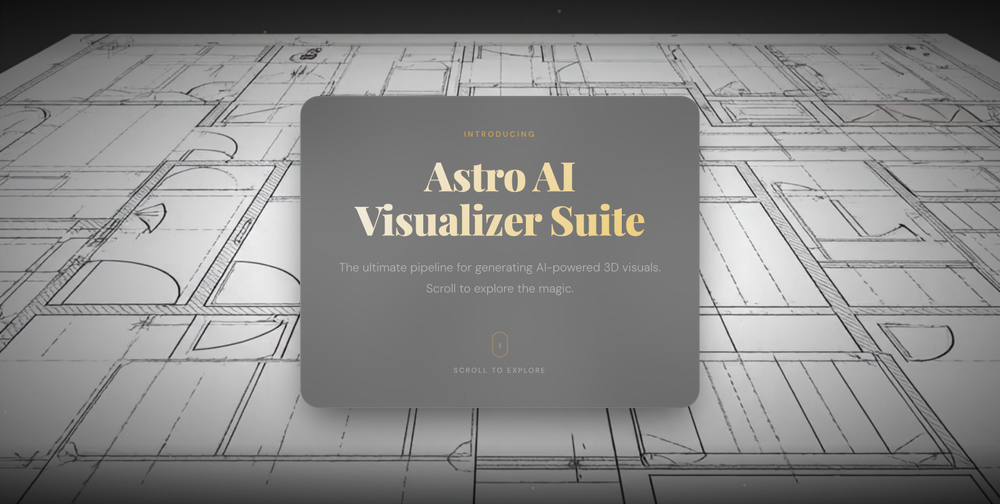
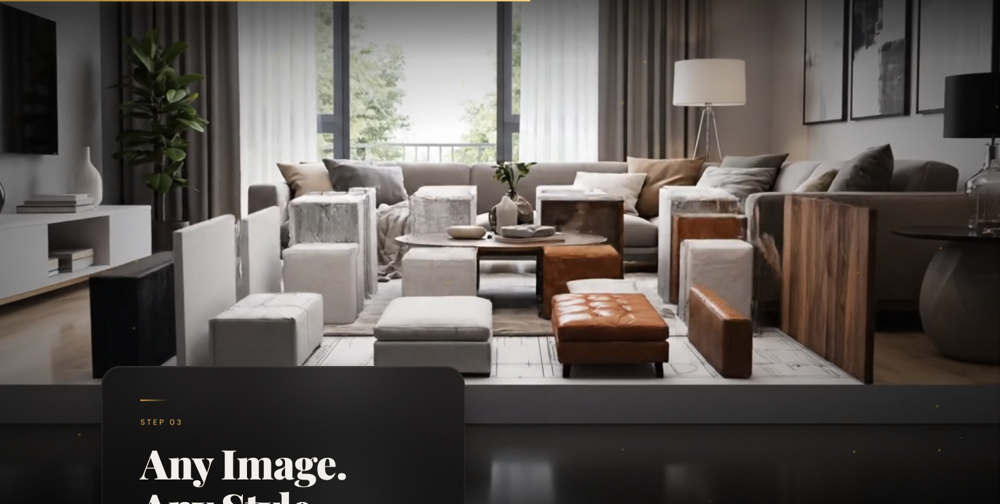
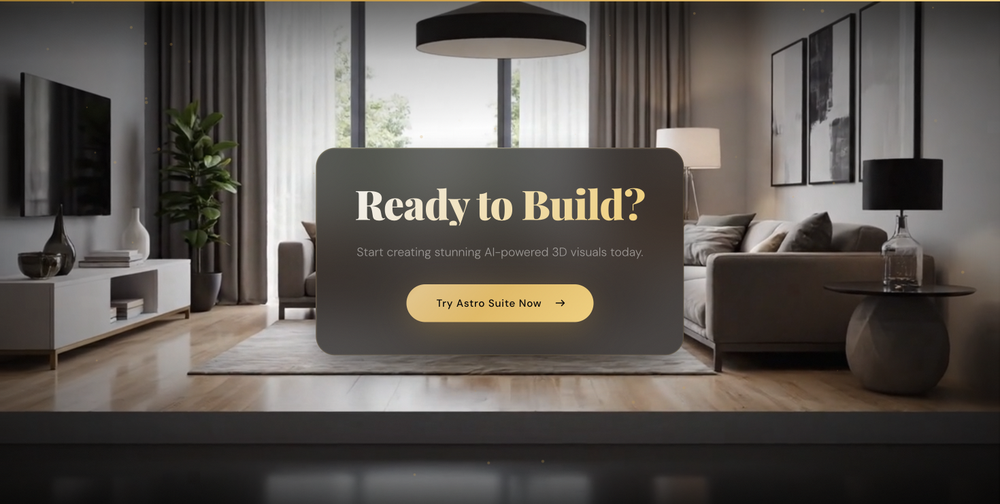

<p align="center">
  
</p>

<h1 align="center">Astro AI Visualizer Suite</h1>

<p align="center">
  <strong>Upload a 2D floor plan. Watch it transform into a photorealistic render. Explore it as a fully interactive 3D scene.</strong><br/>
  All powered by Google Gemini.
</p>

<p align="center">
  <a href="https://astro.sobhanra.com"><strong>Live Demo</strong></a> &nbsp;&middot;&nbsp;
  <a href="https://astro.sobhanra.com/app"><strong>Try the App</strong></a> &nbsp;&middot;&nbsp;
  <a href="https://github.com/Abtinz/Astro"><strong>Source Code</strong></a>
</p>

---

## The Experience

### Scroll-Driven Landing Page

A cinematic, scroll-linked experience where a background video scrubs frame-by-frame as you scroll. Built with canvas-based frame pre-extraction for buttery-smooth playback, floating gold particles, parallax glass cards, and staggered reveal animations.

<p align="center">
  
</p>

### 3D Floor Plan Visualizer

A three-step AI pipeline:

1. **Upload** a 2D architectural floor plan (PNG, JPG, WEBP, HEIC)
2. **Generate 3D Render** — Gemini transforms your blueprint into a photorealistic interior visualization
3. **Generate 3D Scene** — the render is converted into an interactive, explorable HTML scene with Three.js voxel geometry

Download the rendered image or the full 3D scene as a standalone HTML file.

<p align="center">
  
</p>

### Ready to Build?

<p align="center">
  
</p>

---

## How the Pipeline Works

```
Floor Plan (2D image)
        │
        ▼
   Gemini Image Model
   (photorealistic render)
        │
        ▼
   Gemini Streaming Model
   (extract walls → build base → add furniture → validate)
        │
        ▼
   Interactive 3D HTML Scene
   (Three.js + WASD controls + city environment)
```

Each generation phase streams thinking progress to the UI in real time.

---

## Repository Structure

```
.
├── astro-demo.mp4                 # Demo video for landing page
├── start-dev.sh                   # Launch both dev servers
├── scroll-landing/                # Landing page (Vite + vanilla TS)
│   ├── index.html
│   ├── vercel.json                # Rewrites for /app proxy
│   └── src/
│       ├── main.ts                # Video scrubber engine + particles
│       └── style.css              # Cinematic noir luxury theme
└── Astro/
    └── floor-plan-3d/             # App (Vite + React + TypeScript)
        ├── index.html
        ├── vite.config.ts
        └── src/
            ├── App.tsx            # State machine + user flow
            ├── App.css            # Dark luxury UI theme
            ├── components/        # Stepper, UploadZone, Viewer, LoadingOverlay
            ├── services/gemini.ts # Gemini API calls (render + voxel generation)
            └── utils/html.ts      # HTML post-processing (camera, WASD, environment)
```

## Tech Stack

| Layer | Technology |
|-------|-----------|
| **Landing Page** | Vanilla TypeScript, Canvas API, Vite |
| **App** | React 19, TypeScript, Vite |
| **AI** | Google Gemini via `@google/genai` |
| **3D Scenes** | Three.js (generated by Gemini) |
| **Hosting** | Vercel |

---

## Getting Started

### Prerequisites

- Node.js 18+
- A [Gemini API key](https://aistudio.google.com/apikey)

### Setup

```bash
# Clone
git clone https://github.com/Abtinz/Astro.git
cd Astro

# Install dependencies
(cd scroll-landing && npm install)
(cd Astro/floor-plan-3d && npm install)

# Set your Gemini API key
echo "GEMINI_API_KEY=your_key_here" > Astro/floor-plan-3d/.env
```

### Run

```bash
# Start both servers at once
./start-dev.sh
```

Or run them separately:

```bash
# Landing page — http://localhost:5173
cd scroll-landing && npm run dev

# App — http://localhost:3001
cd Astro/floor-plan-3d && npm run dev
```

### Build for Production

```bash
(cd scroll-landing && npm run build)
(cd Astro/floor-plan-3d && npm run build)
```

---

## Deployment

Both apps are deployed on Vercel from this repo:

| Project | Root Directory | URL |
|---------|---------------|-----|
| Landing | `scroll-landing` | [astro.sobhanra.com](https://astro.sobhanra.com) |
| App | `Astro/floor-plan-3d` | [astro.sobhanra.com/app](https://astro.sobhanra.com/app) |

The landing page uses Vercel rewrites to proxy `/app` requests to the app deployment.

### Environment Variables (Vercel)

Set `GEMINI_API_KEY` in the app project's environment variables on Vercel.

---

## Design

Both the landing page and app share a cohesive **cinematic noir luxury** aesthetic:

- Dark background with warm gold (#D4A853) accents
- Glassmorphic cards with backdrop blur
- Outfit (headlines) + DM Sans (body) typography
- Film grain overlay, radial vignette
- Staggered entrance animations, shimmer gradients
- Orbital loading spinner with phase progress

---

## Troubleshooting

| Issue | Fix |
|-------|-----|
| `API_KEY` undefined | Create `.env` in `Astro/floor-plan-3d/` with `GEMINI_API_KEY=...`, restart dev server |
| Port in use | Landing uses 5173, app uses 3001. Kill conflicting process or edit `vite.config.ts` |
| Video not showing | Ensure `astro-demo.mp4` exists and `scroll-landing/public/astro-demo.mp4` symlink is valid |
| Blank page on `/app` | Check Vercel root directory is `Astro/floor-plan-3d` and `GEMINI_API_KEY` env var is set |

## Security

- API calls are made client-side. Do not expose production keys in public deployments without a backend proxy.
- `.env` files are gitignored and never committed.

---

## Team Contributions

| Member | Role | Contributions |
|--------|------|--------------|
| **Abtin Zandi** | Full-Stack Developer | AI pipeline architecture (Gemini integration for render + voxel generation), React app development, 3D scene post-processing (camera, WASD controls, environment injection), Vercel deployment & domain configuration |
| **Sobhan Rahimian** | Frontend Developer & Designer | Scroll-driven landing page (canvas video scrubber, particle system, parallax effects), UI/UX design system (cinematic noir luxury theme), CSS animations & micro-interactions, responsive design |

---

## Source Code

All source code is publicly available at: **[github.com/Abtinz/Astro](https://github.com/Abtinz/Astro)**

## License

MIT
